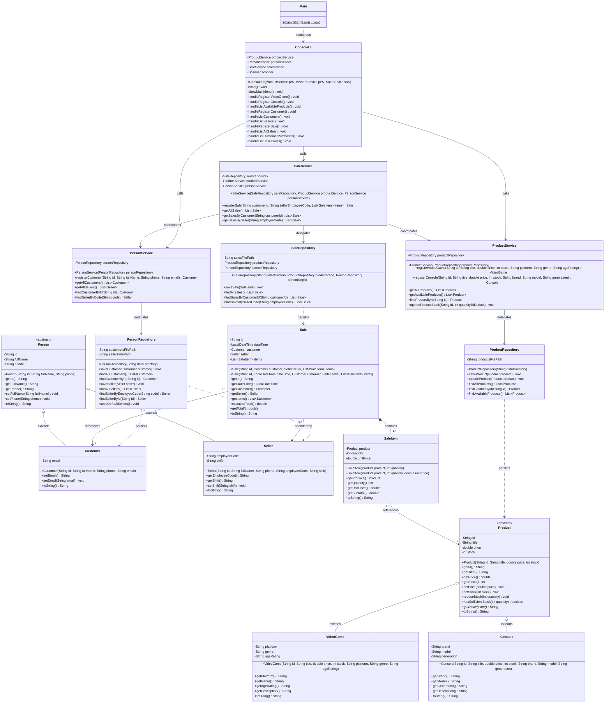

# Complete UML Class Diagram

This diagram specifies all classes across the four architectural layers (`model`, `persistence`, `service`, and `ui`), detailing attributes, methods, UML visibilities (`+` public, `-` private, `#` protected), multiplicities, and relationship types.

