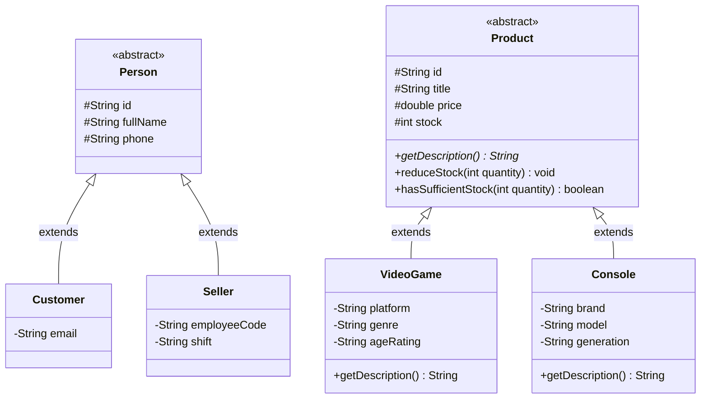

# Model Layer Hierarchy Diagram

This diagram documents the two primary inheritance hierarchies defined in the domain model (`com.gamezone.model`), differentiating between abstract base classes and concrete specializations.

### Architectural Notes
- **Abstract Base Classes**: `Person` and `Product` are declared abstract to prevent direct instantiation of non-specific entities.
- **Polymorphism**: `Product` declares `getDescription()` as an abstract method (`*`), mandating concrete implementations in `VideoGame` and `Console`.
- **Inheritance vs Association**: Only genuine `is-a` generalizations are depicted in this diagram, fulfilling the requirement of maintaining two clear inheritance hierarchies.
