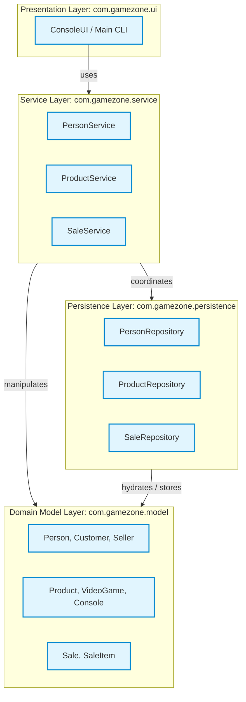

# Layered Architecture Diagram

This diagram specifies the architectural organization into four strict layers and details the allowed and prohibited dependency flows across the system.

## Dependency Rules Matrix

| Source Layer | Target Layer | Status | Justification |
| :--- | :--- | :--- | :--- |
| **UI** | **Service** | **ALLOWED** | UI orchestrates use cases by invoking application services. |
| **UI** | **Persistence** | **PROHIBITED** | Presentation must never bypass business validation and access storage directly. |
| **UI** | **Model** | Restricted | Read-only presentation of DTOs/Entities; no direct state mutation. |
| **Service** | **Model** | **ALLOWED** | Services enforce business logic and manipulate domain entities. |
| **Service** | **Persistence** | **ALLOWED** | Services invoke repositories to persist and retrieve domain aggregates. |
| **Persistence** | **Model** | **ALLOWED** | Repositories serialize and deserialize domain entities to/from data files. |
| **Persistence** | **Service / UI** | **PROHIBITED** | Lower-level data access components must have zero knowledge of callers. |
| **Model** | **Any Layer** | **PROHIBITED** | Domain core is pure Java, completely independent of frameworks, files, or UI. |
